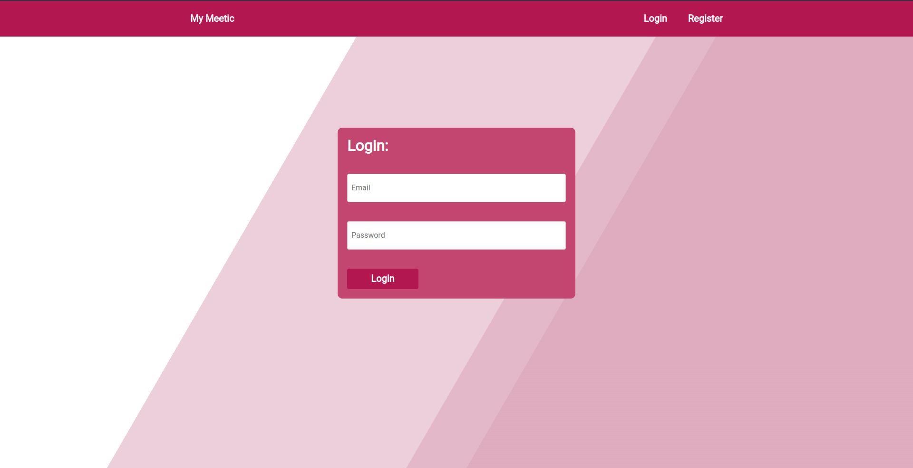
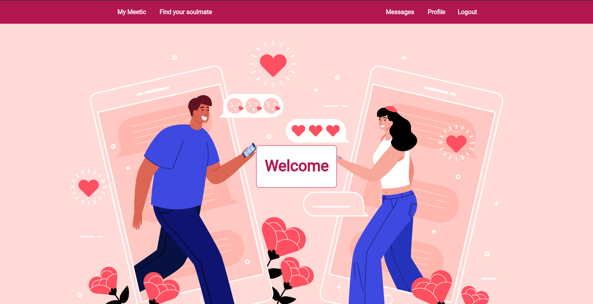
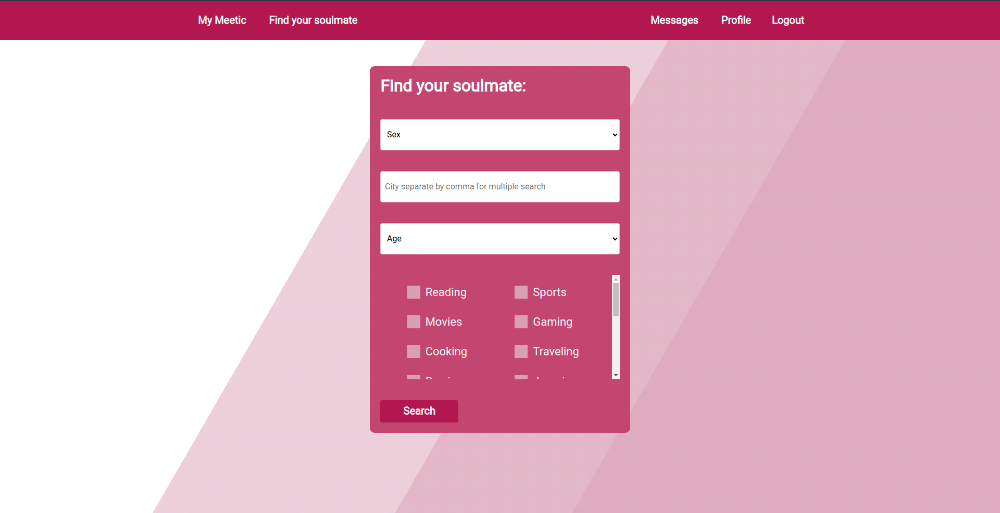
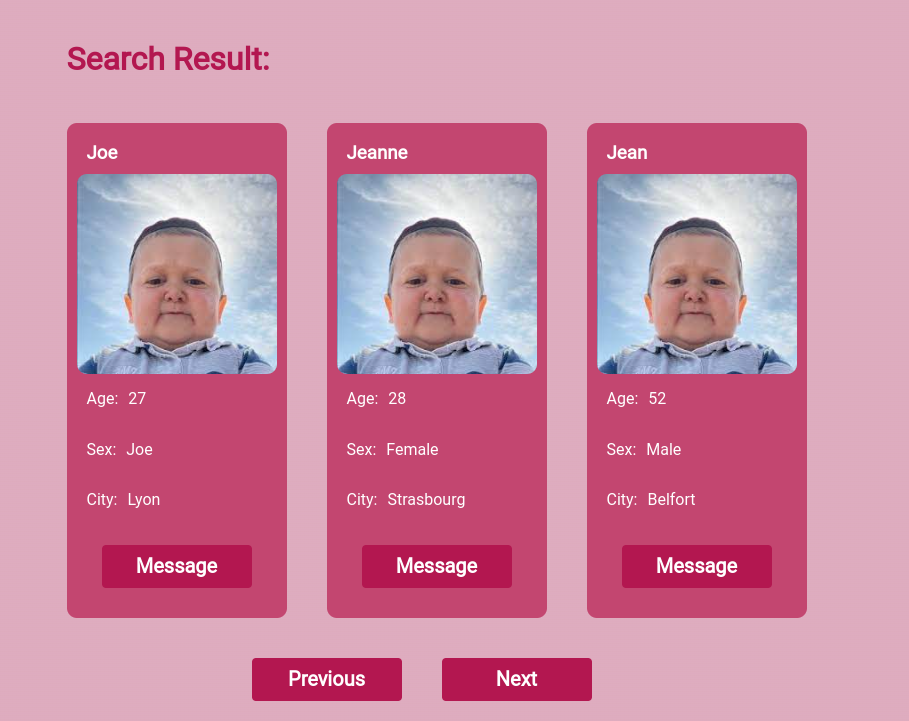

# epitech-my-meetic

## FR

Ce projet avait pour but de nous apprendre à faire une recherche, login et register front et back. 

Technologie utilisée : PHP, Javascript (+ jQuery), HTML, CSS (+ SASS)

## EN

This project's goal was to teach us how to create a search system, a login and a register front and back.

Technologies used : PHP, Javascript (+ jQuery), HTML, CSS ( + SASS)

## Screenshots :

### Login

### Main Page / Page d'accueil

### Search / Recherche

###  Search Results / Resultat de recherche

